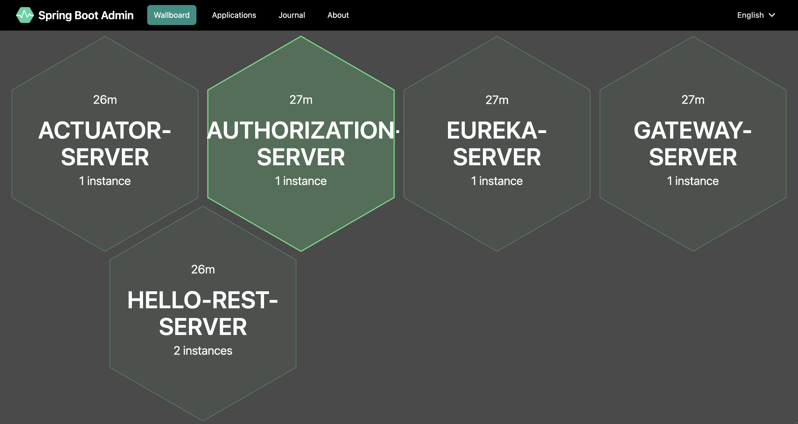

# Spring Boot Challenge

This is a private challenge to build a Spring Boot Environment on the latest feature and releases.

The Project itself is still progressing, in getting new reflections or informations that add new features or change older reflections.

Based on: https://spring.io/microservices

image::doc/challenge.png[]

Current links exposed by the API Gateway:

https://127.0.0.1:8080/actuator-service

https://127.0.0.1:8080/zipkin-service

https://127.0.0.1:8080/eureka-service

https://127.0.0.1:8080/hello-service/hello

https://127.0.0.1:8080/authorization-service/login

image::doc/zipkin.png[]
